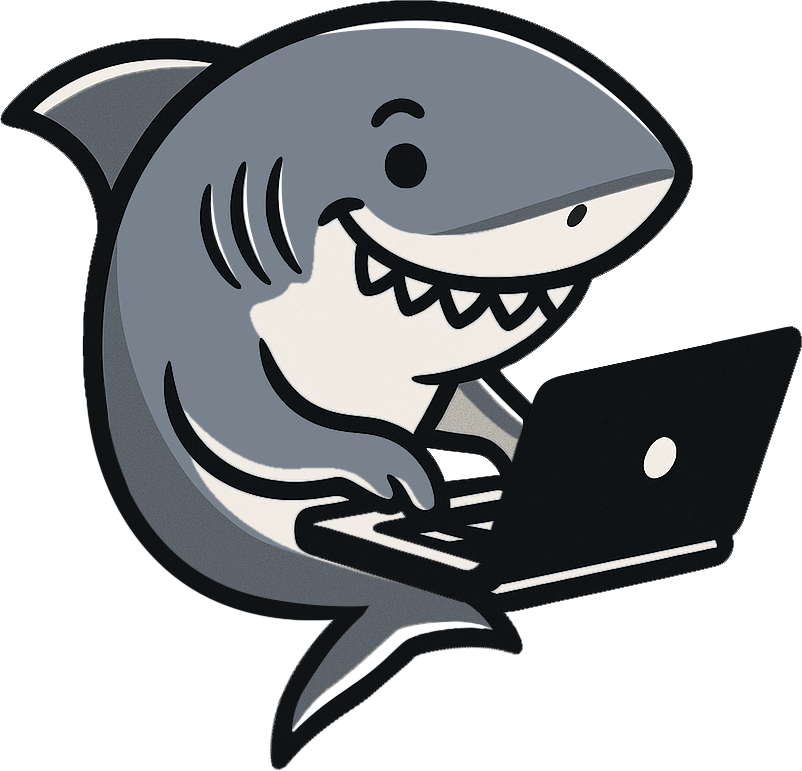

## Hi there! ⚓ Welcome aboard my sea of code! 👩🏻‍💻🦈</h2>

  

  
  &nbsp;&nbsp;&nbsp;
  

---

## About me </h2>

<table>
  <tr>
    <td></td>
    <td valign="top" style="padding-left: 15px;">
      <h2>About Me 
      </h2>
      

        I'm Aday, a fullstack JavaScript developer in training based in Madrid, Spain. 
        I'm currently immersed in an intensive Bootcamp, coding day and night 🌙✨.  
        I'm passionate about web development, clean code and building projects that are not only functional but also beautiful and meaningful. 
        I believe learning is a lifelong voyage, and I'm loving the sea of possibilities that tech offers! 🌊  
        Besides coding, I love photography, visual design, and any excuse to organize things with Notion 😄. 
        I'm always eager to collaborate, learn from others, and grow with each line of code.
      

    </td>
  </tr>
</table>

---

## Technologies & Tools

  
  
  
  
  
  

---

##  Meet Chompy 🦈

<h2 align="center" style="color:#36BCF7FF;">Meet Chompy</h2>

  

  <strong>Chompy</strong> is the official shark guarding my projects, 
  swimming fearlessly through lines of code. 🦈  
  Don’t worry, he doesn’t bite... unless the indentation is off. 😄  
  This logo represents my work style: straightforward, efficient, 
  with a touch of sea adventure. ⚓🐚  
  I hope you like it as much as I enjoy creating alongside him!

---

## Contact

  📫 You can reach me at @ 
  <a href="mailto:aday.it25@gmail.com">Email</a>  
  or connect on  LinkedIn
  

---

  
🚀 My GitHub Stats - Click to view!

---
 

 

---

<h3 align="center">⛵ Thanks for sailing through my GitHub!</h3>

<i>May your own journey be full of smooth commits and creative storms. ⚡​</i>

