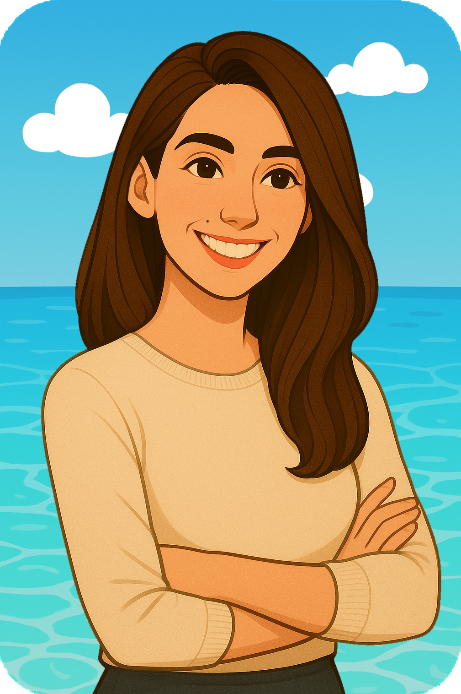

<h2 align="center" style="color:#36BCF7;">Hi there! ⚓ Welcome aboard my sea of code! 👩🏻‍💻🦈</h2>

  
  &nbsp;&nbsp;&nbsp;
  

---

## About me

<table>
  <tr>
    <td>
      
    </td>
    <td style="padding-left: 20px;">
        
        Hi! I'm Ady, a fullstack JavaScript student with a passion for the sea and coding. 
        Sail with me through this ocean of projects, ideas, and learning. 
        I hope you enjoy exploring this sea of code as much as I enjoy creating it.
        
    </td>
  </tr>
</table>

---

## Technologies & Tools

  
  
  
  
  
  

---

## 🦈 Meet Chompy

<h2 align="center" style="color:#36BCF7FF;">Meet Chompy</h2>

  

  <strong>Chompy</strong> is the official shark guarding my projects, 
  swimming fearlessly through lines of code. 🦈  
  Don’t worry, he doesn’t bite... unless the indentation is off. 😄  
  This logo represents my work style: straightforward, efficient, 
  with a touch of sea adventure. ⚓🚠 
  I hope you like it as much as I enjoy creating alongside him!

---

## Contact

📫 You can find me at:  
<h3 align="center">
  📬 <a href="mailto:aday.it25@gmail.com">@Contacto</a> • 
  
</h3>

  
🚀 My GitHub Stats - Click to view!

---

  

  ⛵ <strong>Thanks for sailing through my GitHub!</strong> 
  May your journey be full of smooth commits and creative storms. 🚀

---

   

  

   

  

